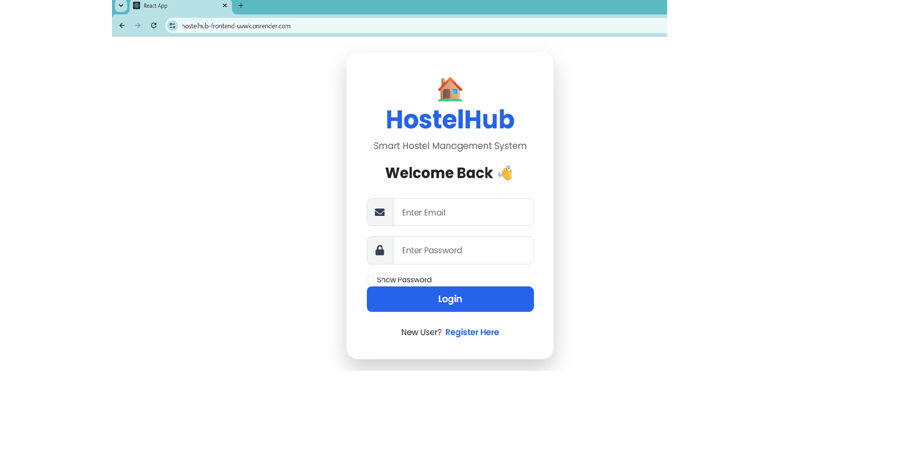
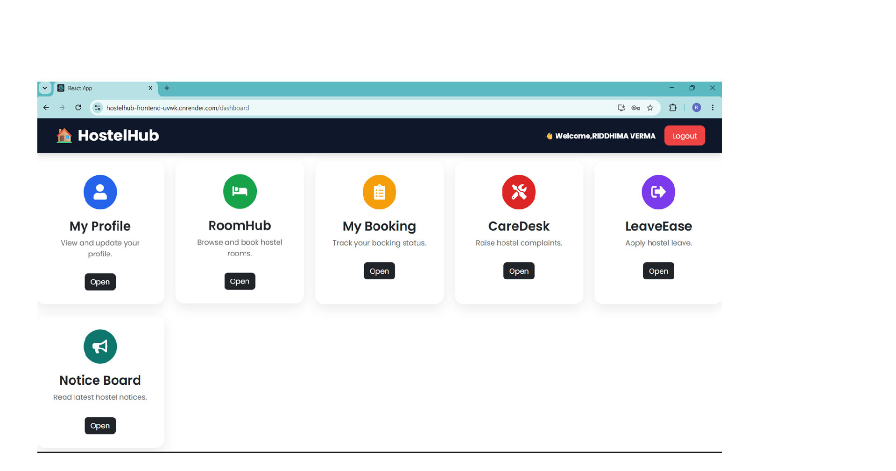
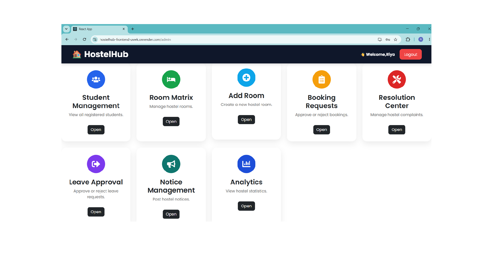
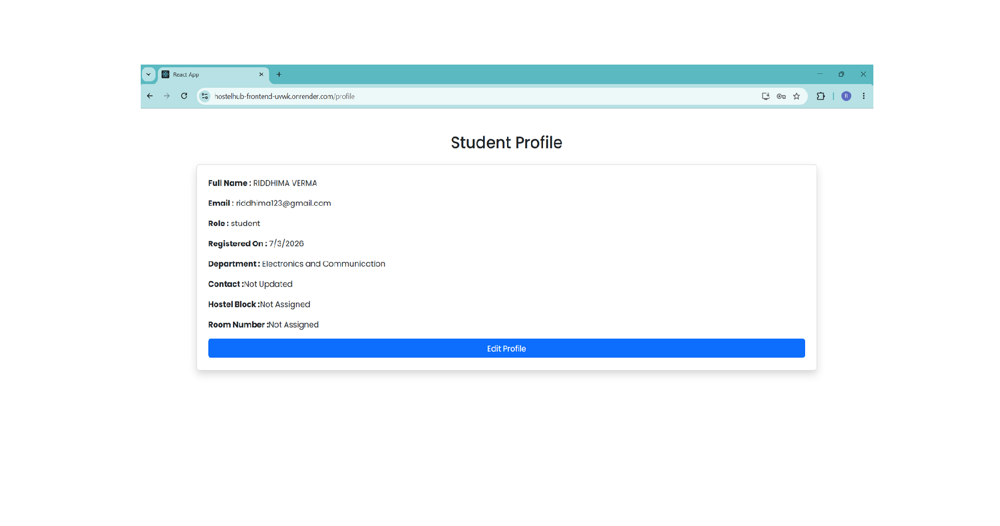
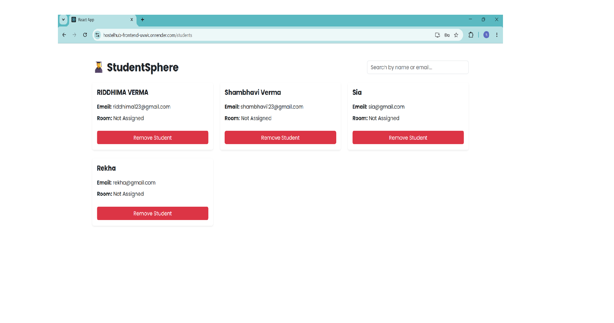
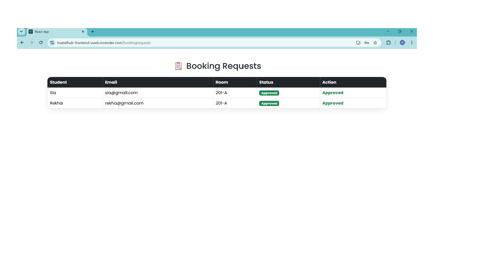
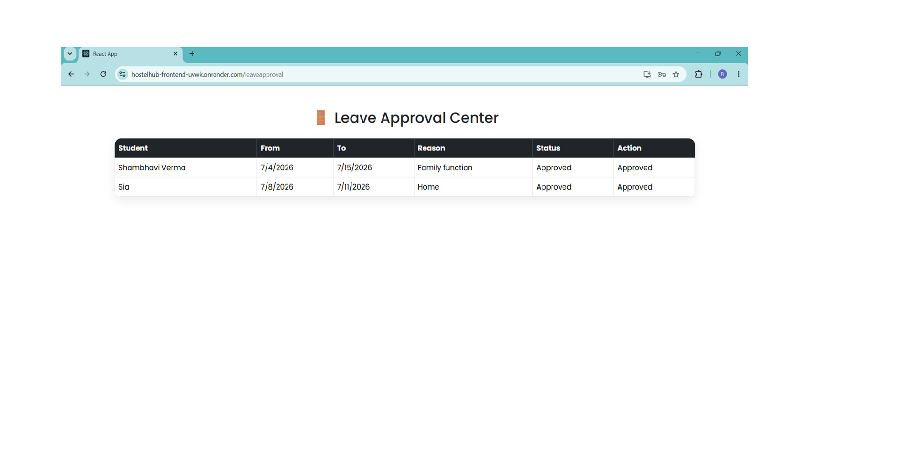
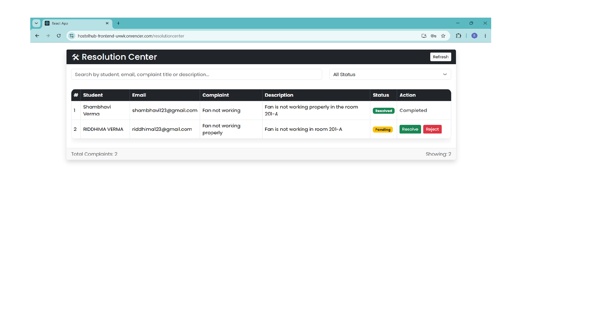
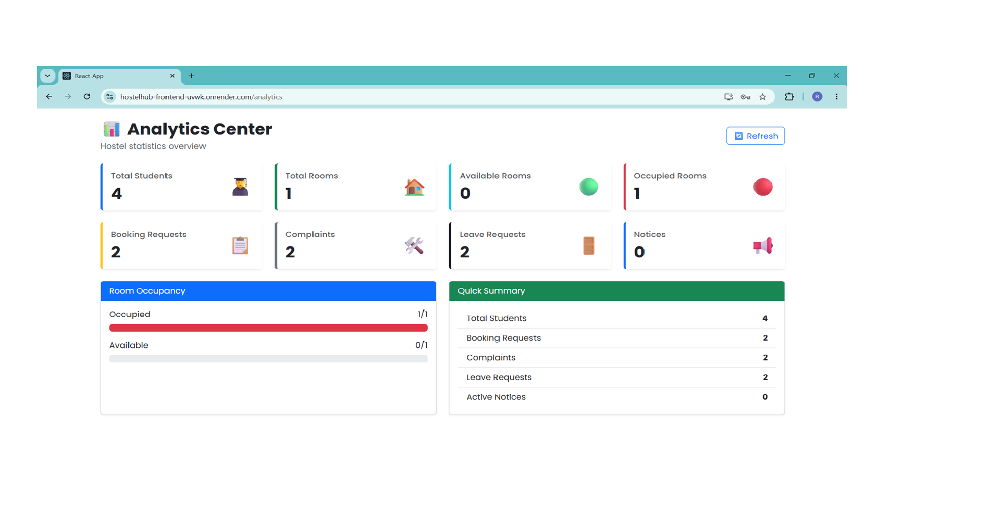

# 🏠 HostelHub – Smart Hostel Management System


---

# 📖 Overview

HostelHub is a full-stack MERN (MongoDB, Express.js, React.js, Node.js) based Hostel Management System developed to simplify hostel administration and improve the student accommodation experience.

The system provides separate dashboards for Students and Administrators with secure authentication, room booking, complaint management, leave approval, notices, analytics, and profile management.

---

# 🌐 Live Demo

## Frontend

https://hostelhub-frontend-uvwk.onrender.com

## Backend

https://hostelhub-backend-sldr.onrender.com

---

# ✨ Features

## 👨‍🎓 Student

- Student Registration
- Secure Login
- Profile Management
- View Available Rooms
- Book Hostel Rooms
- View Booking Status
- Apply Leave
- Raise Complaints
- View Notices

---

## 👨‍💼 Admin

- Admin Dashboard
- Student Management
- Room Management
- Booking Management
- Leave Approval
- Complaint Resolution
- Notice Management
- Analytics Dashboard

---

# 🛠 Tech Stack

### Frontend

- React.js
- React Router DOM
- Axios
- Bootstrap
- Bootstrap Icons
- SweetAlert2
- Chart.js

### Backend

- Node.js
- Express.js
- MongoDB Atlas
- Mongoose
- JWT Authentication
- bcrypt.js

### Deployment

- Render
- MongoDB Atlas
- GitHub

---

# 📂 Project Structure

```
HostelHub-Frontend
│
├── public
├── screenshots
├── src
│   ├── components
│   ├── pages
│   ├── assets
│   ├── App.js
│   └── index.js
│
├── package.json
└── README.md
```

---

# 📸 Project Screenshots

## 🔐 Login Page



---

## 👨‍🎓 Student Dashboard



---

## 👨‍💼 Admin Dashboard



---

## 👤 Profile



---

## 📋 Student Management



---

## 🛏 Booking Management



---

## 📝 Leave Management



---

## ⚠ Complaint Management



---

## 📊 Analytics Dashboard



---

# 🚀 Installation

Clone the repository

```bash
git clone https://github.com/vermarids079-bot/HostelHub-Frontend.git
```

Move into the project directory

```bash
cd smart-hostel-management
```

Install dependencies

```bash
npm install
```

Start the project

```bash
npm start
```

---

# 🔗 Backend API

Backend URL

https://hostelhub-backend-sldr.onrender.com

---

# 🔐 Authentication

The project implements:

- JWT Authentication
- Password Encryption using bcrypt.js
- Protected Routes
- Role-Based Access Control

---

# 🚀 Future Enhancements

- Email Notifications
- QR Code Room Entry
- Hostel Fee Management
- Mobile Application
- AI Chatbot
- Attendance System

---

# 👩‍💻 Developer

### Riddhima Verma

Bachelor of Technology

MERN Stack Developer

GitHub:

https://github.com/vermarids079-bot

---

# ⭐ If you like this project, don't forget to give it a Star!
